<div align="center">


# Navix

### AI-Powered Project Management & Guidance System

Navix turns a developer's skills and goals into a complete, actionable project — generating ideas, refining scope, drafting a full Product Requirements Document (PRD), building a milestone roadmap, predicting delivery risk, and supervising the work to completion. It is powered by **Navi**, a custom fine-tuned large language model that lives at the center of the experience.

[](https://flutter.dev)
[](https://dart.dev)
[](https://firebase.google.com)
[](#-architecture)

<sub>🎓 Developed as a <strong>Final Year Project (FYP)</strong>.</sub>

</div>

---

## Table of Contents

- [Overview](#-overview)
- [Screenshots](#-screenshots)
- [Feature Set](#-feature-set)
- [The Navi AI Model](#-the-navi-ai-model)
  - [Inside the `ai/` Directory](#inside-the-ai-directory)
  - [How the Model Was Trained](#how-the-model-was-trained)
  - [How the App Talks to Navi](#how-the-app-talks-to-navi)
- [Architecture](#-architecture)
- [Technology Stack](#-technology-stack)
- [Project Structure](#-project-structure)
- [Installation & Setup](#-installation--setup)
- [Usage Examples](#-usage-examples)
- [Configuration Reference](#-configuration-reference)
- [Contributing](#-contributing)

---

## 🚀 Overview

**Navix** is a cross-platform Flutter application that acts as an AI co-founder and project manager for developers, students, and teams. Instead of staring at a blank page, a user enters their **skills**, **goals**, and **preferences**, and Navix walks them through a guided, AI-assisted pipeline:

```
Skills & Goals  →  Project Ideas  →  Idea Refinement  →  PRD  →  Roadmap (milestones + tasks)
                                                                          │
                          Risk Prediction  ◄── Project Supervision ◄──────┘
                          Team Analysis          (chat + actions)
                          Surveys & Community
```

Every AI-driven step — idea generation, scope refinement, requirements documents, roadmaps, risk analysis, team-role suggestions, surveys, and an in-app conversational assistant — is served by **Navi**, a privately fine-tuned model rather than a third-party API. This keeps generation behavior consistent, on-brand, and self-hostable.

Beyond the solo workflow, Navix is also a **collaboration platform**: users can publish project listings, find teammates, manage team membership and roles, chat in real time, run feedback surveys, and participate in a community feed with posts, comments, and voting.

**Supported platforms:** Android, iOS, Web, Windows, and macOS (icons and splash screens are generated for all five).

---

## 📱 Screenshots

<div align="center">

<table>
  <tr>
    <td>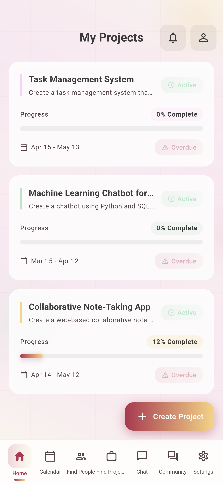</td>
    <td>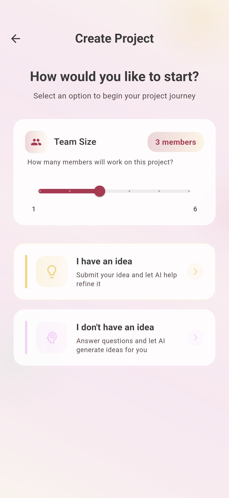</td>
    <td>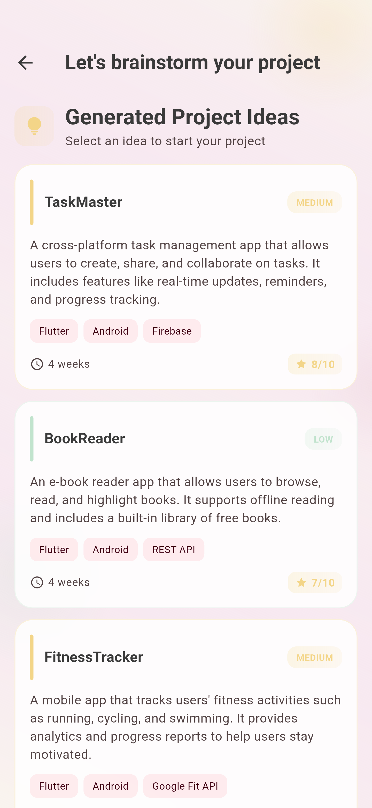</td>
  </tr>
</table>

<details>
<summary><strong>🖼️ View all 19 screenshots</strong></summary>

<br/>

<table>
  <tr>
    <td>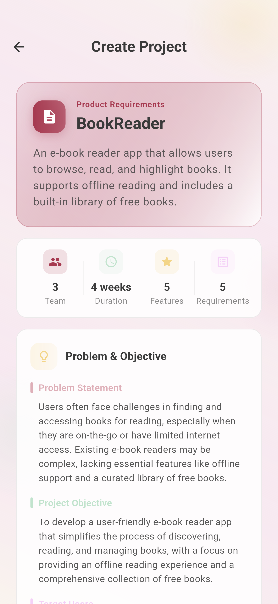</td>
    <td>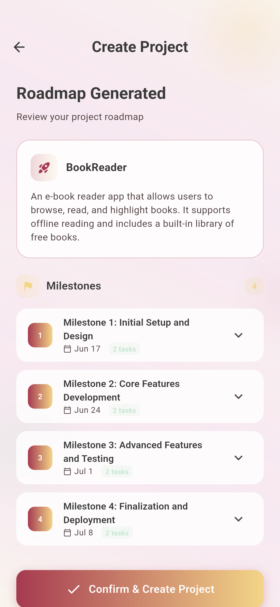</td>
    <td>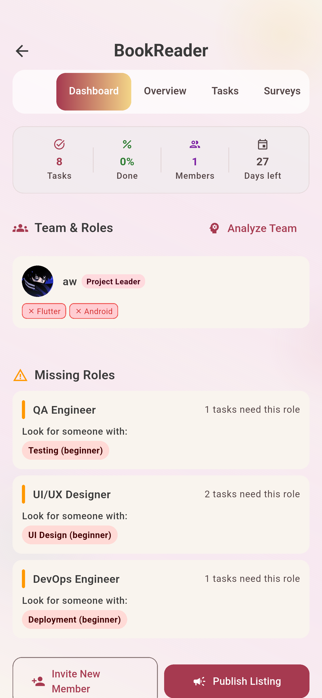</td>
    <td>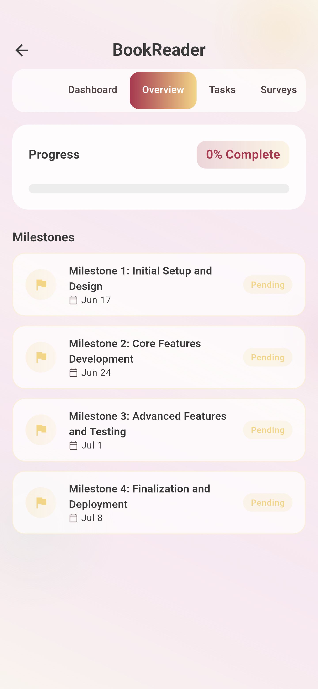</td>
  </tr>
  <tr>
    <td>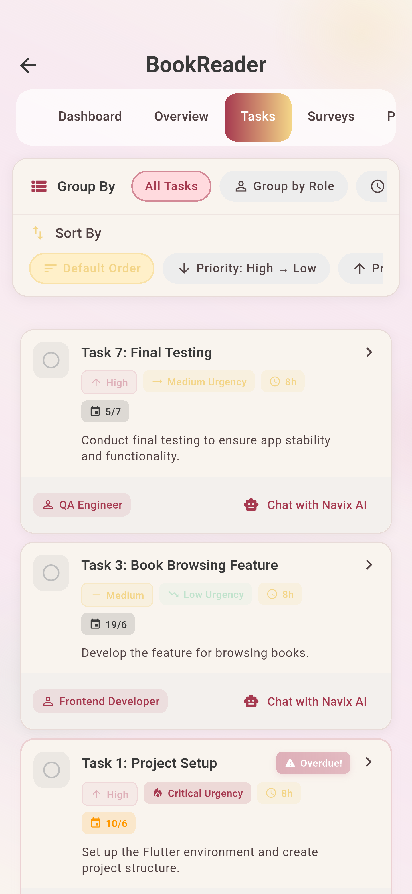</td>
    <td>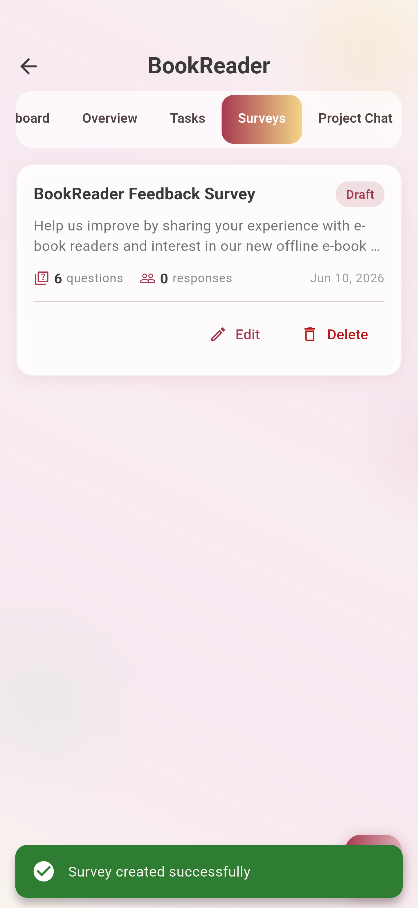</td>
    <td>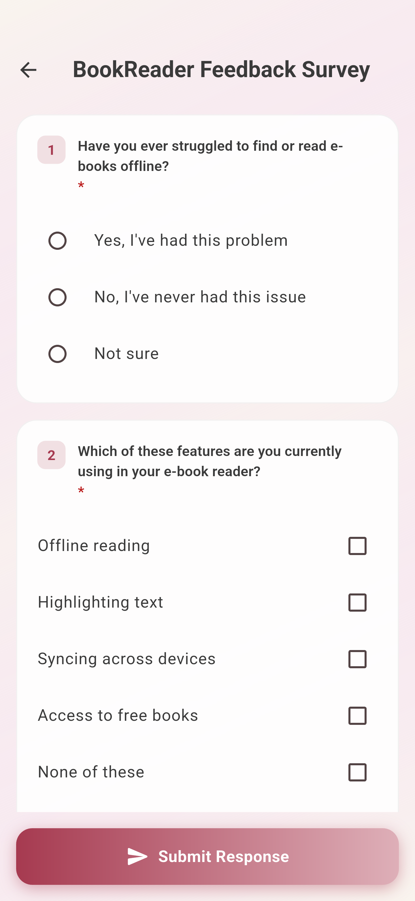</td>
    <td>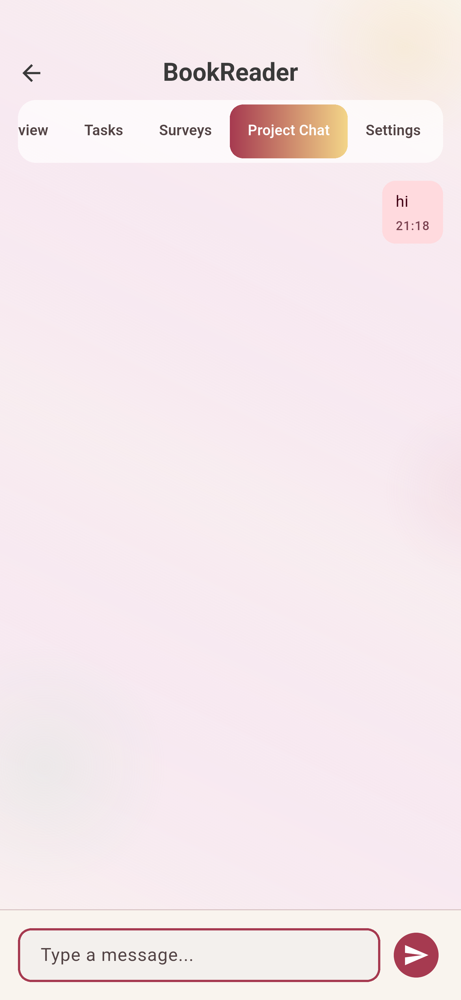</td>
  </tr>
  <tr>
    <td>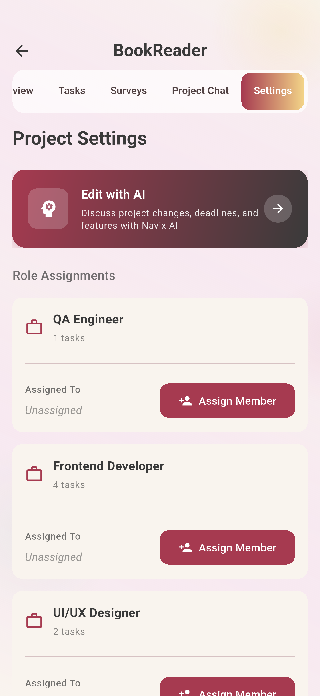</td>
    <td>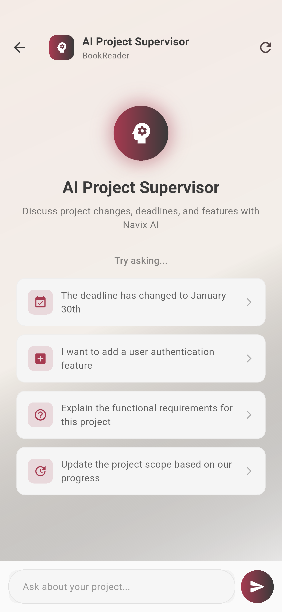</td>
    <td>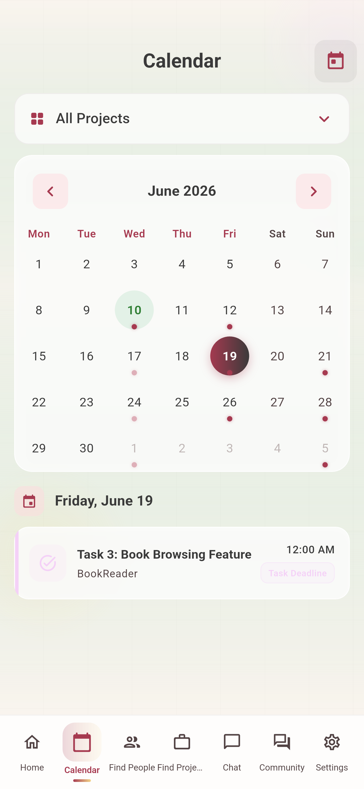</td>
    <td>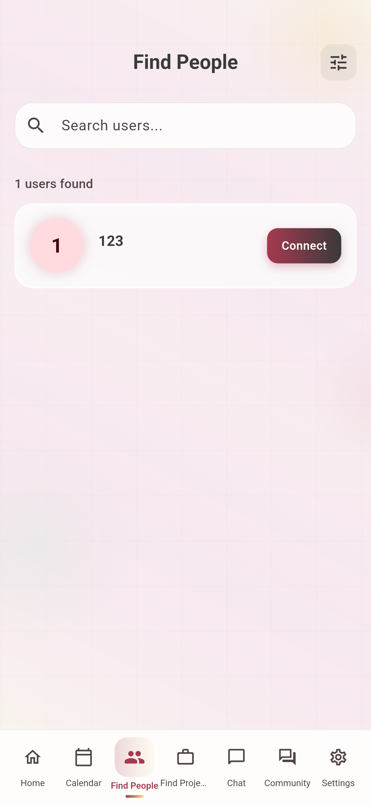</td>
  </tr>
  <tr>
    <td>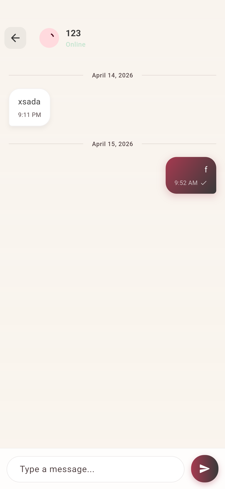</td>
    <td>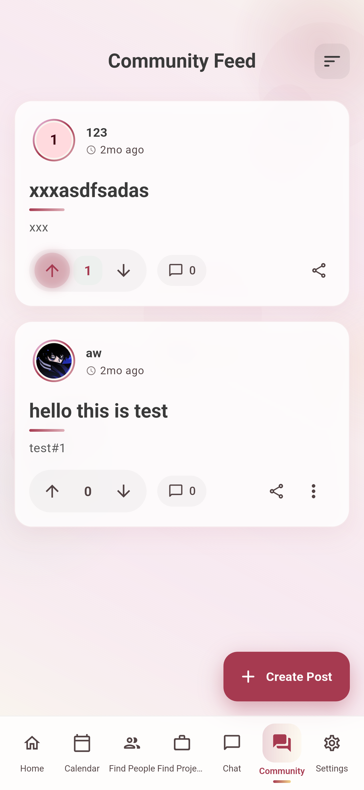</td>
    <td>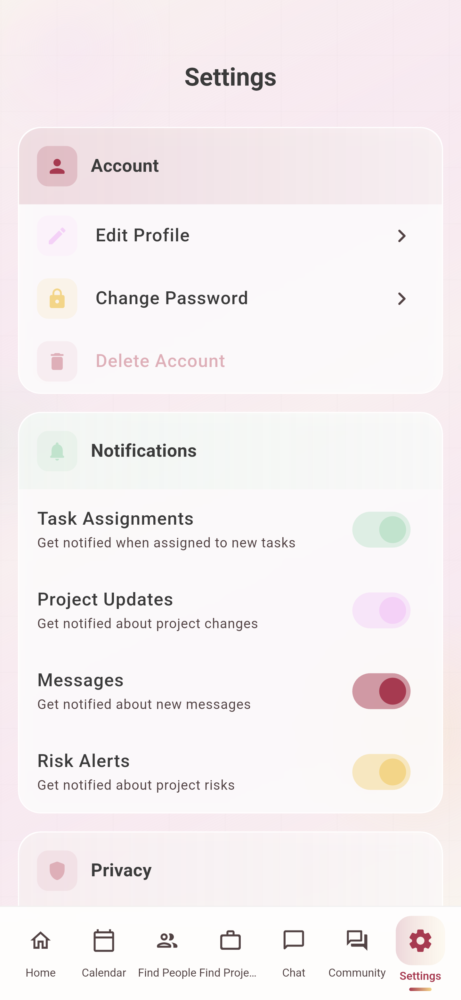</td>
    <td>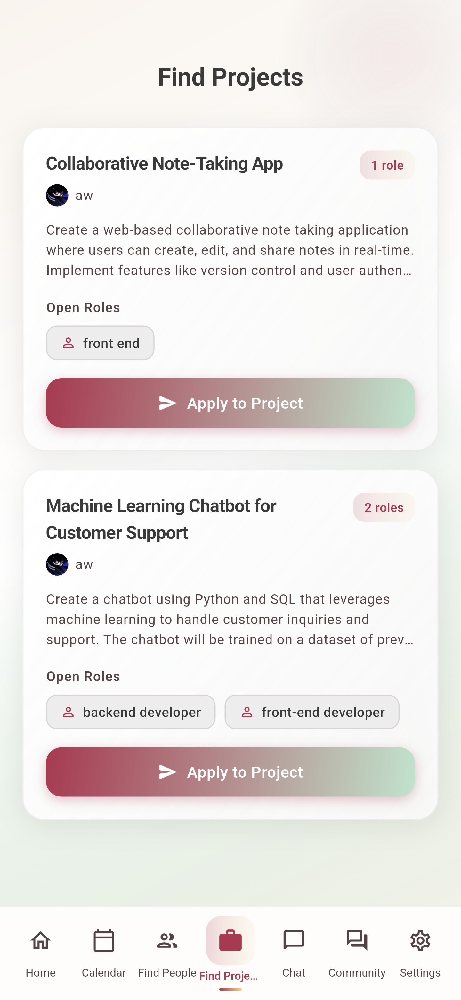</td>
  </tr>
</table>

</details>

</div>

---

## ✨ Feature Set

Navix is organized into 19 feature modules. The table below maps each to what it does for the user.

### AI & Project Planning

| Feature | Description |
|---|---|
| **Idea Generation** | Generates 3 diverse, skill-matched project ideas from the user's skills, goals, and preferences — each with complexity, estimated duration, and a feasibility score. Supports solo and team modes. |
| **Idea Refinement** | Takes a raw idea and returns an improved description, scope clarification, suggested features, a 1–10 feasibility assessment, and required skills — automatically flagging which skills the user already has vs. needs to learn. |
| **PRD Generation** | Produces a comprehensive Product Requirements Document: problem statement, objectives, target users, in/out-of-scope items, core features, functional & non-functional requirements, per-feature detail, and acceptance criteria. |
| **PRD Editor** | Conversationally edit an existing PRD ("make the audience college students", "add dark mode") and apply the AI's structured updates. |
| **Roadmap Generation** | Breaks a PRD into milestones (with deadlines) and granular tasks (with detailed implementation steps and hour estimates). |
| **Risk Prediction** | Analyzes project health and predicts delay probability, risk level, blocked tasks, and recommendations. |
| **Project Supervisor** | An AI supervisor ("Navi") chats about project progress and proposes **executable actions** (e.g., extend a milestone deadline) the user can approve in one tap. |
| **AI Chat Assistant** | A context-aware conversational assistant (project- or task-scoped) for technical help, motivation, and guidance — with streaming responses. |

### Profile, Skills & Discovery

| Feature | Description |
|---|---|
| **Authentication** | Email/password auth via Firebase, with a guided "needs profile" onboarding flow. |
| **Profile** | Create and edit a developer profile, upload a profile picture, and manage skills. |
| **Skill Testing** | AI-generated skill-verification quizzes (multiple-choice, short-answer, code evaluation across difficulties) that validate and certify a user's claimed skills. |
| **Find People** | Search and discover other users by skills and attributes. |
| **Find Projects** | Browse project listings, publish your own, apply to join, and manage incoming join requests. |

### Collaboration & Community

| Feature | Description |
|---|---|
| **Team Management** | Send/accept/decline invitations, assign and change member roles, and remove members. **Team Analysis** suggests roles per member and flags missing roles. |
| **Real-Time Chat** | Direct and project conversations with a chat list and conversation screens. |
| **Community Feed** | Create, edit, and delete posts; threaded comments and replies; up/down voting with a time-decayed "hot" ranking computed server-side. |
| **Surveys** | Create, edit, distribute, and take user-feedback surveys tied to a project (with AI-assisted survey generation). |
| **Notifications** | A notification center backed by push messaging and Cloud Functions (e.g., new comment / reply alerts). |

### Workspace & Productivity

| Feature | Description |
|---|---|
| **Project Workspace** | A rich dashboard per project: activity feed, admin dashboard, milestone overview, deadline alerts, workload balance, and a risk section (with `fl_chart` visualizations). |
| **Tasks** | Task detail views, status updates, and threaded task comments. |
| **Calendar** | A `table_calendar`-based view aggregating project events and deadlines. |
| **Settings & Theming** | Light/dark theme switching (persisted via a `ThemeCubit`) and app settings. |

---

## 🧠 The Navi AI Model

The intelligence behind Navix is **Navi** — a custom model fine-tuned from **Qwen3-14B** and served to the app under the model name `navix-ai`. Navi is given a consistent persona ("the friendly and energetic mascot AI of the Navix app") and is explicitly trained to never reveal its base architecture (Qwen/Alibaba) or describe itself as a generic language model — it is always "Navi from Navix."

Everything needed to **regenerate the dataset, fine-tune the model, and serve it** lives in the [`ai/`](ai/) directory.

### Inside the `ai/` Directory

| File | Purpose |
|---|---|
| [`ai/ai_dataset_generator.py`](ai/ai_dataset_generator.py) | **Synthetic dataset generator.** Uses local [Ollama](https://ollama.com) models to produce instruction/input/output training examples across every Navix AI feature. |
| [`ai/navix_local_dataset.jsonl`](ai/navix_local_dataset.jsonl) | The generated **training dataset** (~2,355 examples) in JSON Lines format. |
| [`ai/navi_training_notebook.ipynb`](ai/navi_training_notebook.ipynb) | The **fine-tuning notebook** (Unsloth + LoRA) used to train Qwen3-14B on the dataset and push the merged model to Hugging Face. |
| [`ai/Modelfile`](ai/Modelfile) | An **Ollama Modelfile** that wraps the quantized GGUF weights with the correct ChatML template, stop tokens, sampling temperature, and baked-in system prompt — turning the raw model into the runnable `navix-ai` model. |
| [`ai/app.py`](ai/app.py) | A **cloud serving option** using [Modal](https://modal.com) + [vLLM](https://github.com/vllm-project/vllm) to expose the GGUF model behind a FastAPI HTTP endpoint on an A10G GPU. |
| [`ai/.env.example`](ai/.env.example) | Template for the `HF_TOKEN` (Hugging Face write token) required to push/pull model weights. |

### How the Model Was Trained

Training Navi is a three-stage pipeline: **(1) generate data → (2) fine-tune → (3) package & serve.**

#### Stage 1 — Synthetic Data Generation (`ai_dataset_generator.py`)

Rather than hand-labeling data, Navix bootstraps its dataset from **two local "teacher" models** running in Ollama, chosen for complementary strengths:

- **`qwen2.5-coder:14b`** (`coder`) — used for structured, schema-heavy generation (idea generation, PRDs, roadmaps, skill quizzes, team analysis).
- **`deepseek-r1:8b`** (`logic`) — used for reasoning-heavy, persona-driven tasks (PRD editing, risk prediction, surveys, supervisor chat, and Navi's personality).

The generator runs a **chained, realistic pipeline** that mirrors how the app is actually used:

1. **Synthetic personas** — generates ~250 diverse developer/architect personas (varied skills, tech stacks, goals, durations from 3–12 months).
2. **Skill data** — for the persona skills (plus a curated seed list), it produces `skill_validation` and `skill_quiz_generation` examples.
3. **Project chains** — for each persona it generates a full chain: `idea_generation → prd_generation → prd_editing → roadmap_generation → risk_prediction → team_analysis → survey_generation → supervisor_chat`, where each step's output feeds the next (e.g., the roadmap is built from the freshly generated PRD).
4. **Personality data** — ~200 `navi_chat` examples that lock in Navi's voice, including identity questions ("Are you Qwen?") whose answers enforce the "I am Navi" guardrail.

A `clean_json_response()` helper strips `<think>` reasoning blocks and markdown fences so every record's `output` is clean, parseable text. Each line is written to `navix_local_dataset.jsonl` with a uniform schema:

```json
{
  "feature": "idea_generation",
  "input": "{\"skills\": [\"Flutter\", \"Firebase\"], \"goals\": \"...\"}",
  "instruction": "Generate 3 project ideas based on skills and goals.",
  "output": "[ { \"title\": \"...\", \"feasibilityScore\": 8 } ]"
}
```

**Approximate dataset composition (~2,355 examples):**

| Feature | Count | | Feature | Count |
|---|---|---|---|---|
| `idea_generation` | 250 | | `team_analysis` | 249 |
| `prd_generation` | 250 | | `survey_generation` | 249 |
| `prd_editing` | 250 | | `supervisor_chat` | 249 |
| `roadmap_generation` | 249 | | `navi_chat` | 200 |
| `risk_prediction` | 249 | | `skill_validation` | 80 |
| | | | `skill_quiz_generation` | 80 |

#### Stage 2 — Fine-Tuning (`navi_training_notebook.ipynb`)

The notebook fine-tunes **`unsloth/Qwen3-14B`** using [Unsloth](https://github.com/unslothai/unsloth) for memory-efficient training (runs on a single GPU, e.g. on Kaggle/Colab):

- **Base model:** `unsloth/Qwen3-14B`, loaded in **4-bit** (`load_in_4bit=True`) with a 2048-token context.
- **Method:** **LoRA** (parameter-efficient fine-tuning) via `FastLanguageModel.get_peft_model` — `r=32`, `lora_alpha=64`, `lora_dropout=0`, applied to all attention and MLP projection layers (`q/k/v/o_proj`, `gate/up/down_proj`), with Unsloth gradient checkpointing.
- **Data formatting:** each record's `instruction` (+ optional `input` as "Context/Input") becomes the user turn and `output` the assistant turn, rendered with the tokenizer's chat template, then shuffled.
- **Trainer:** TRL `SFTTrainer` — 2 epochs, effective batch size 8 (`batch_size=1 × grad_accum=8`), learning rate `2e-4`, linear scheduler, `adamw_8bit` optimizer, `weight_decay=0.001`, seed `3407`.
- **Export:** LoRA adapters are saved, then merged into 16-bit weights and pushed to Hugging Face (`push_to_hub_merged(..., save_method="merged_16bit")`) as `aw-s/qwen3_custom_modesl`.

The merged model is subsequently **quantized to GGUF (Q4_K_M)** for efficient inference (`aw-s/qwen3_custom_modesl-Q4_K_M-GGUF`).

#### Stage 3 — Packaging & Serving

Two serving paths are provided:

- **Local / on-device-adjacent (Ollama):** [`ai/Modelfile`](ai/Modelfile) wraps the GGUF weights with the exact **Qwen ChatML template**, the required stop tokens (`<|im_start|>`, `<|im_end|>`, `<|endoftext|>`), a low `temperature` of `0.3` for adherence to training, and the baked-in `SYSTEM` prompt. Building it (`ollama create navix-ai -f ai/Modelfile`) yields the `navix-ai` model the app calls.
- **Cloud (Modal + vLLM):** [`ai/app.py`](ai/app.py) downloads the GGUF weights into a persistent Modal volume and serves them with vLLM on an **A10G GPU**, exposing a `POST` FastAPI endpoint that accepts the same `{prompt, options}` shape and returns `{"response": ...}`. It reuses the Qwen3-14B tokenizer and applies the same ChatML formatting and stop tokens.

### How the App Talks to Navi

The Flutter app is **server-agnostic** — it speaks the Ollama HTTP API to a model literally named `navix-ai`. The base URL is configured in [`lib/core/constants/api_constants.dart`](lib/core/constants/api_constants.dart):

```dart
static const String ollamaBaseUrl = 'http://10.0.2.2:11434'; // Android emulator → host machine
static const String ollamaGenerateEndpoint = '/api/generate';
```

> `10.0.2.2` is the special alias the Android emulator uses to reach `localhost` on the host machine running Ollama. Replace it with your machine's LAN IP (or your Modal endpoint) when running on a physical device. Timeouts are set to 300s to accommodate cold starts and long generations.

Each feature's data source builds a strict **"respond ONLY with valid JSON"** prompt, posts it with feature-appropriate sampling options (e.g. higher `temperature: 0.8` for idea brainstorming, `0.7` for PRDs/chat), and then sanitizes the response — stripping `<think>…</think>` blocks and markdown code fences — before parsing it into typed Dart entities. See [`ai_remote_datasource.dart`](lib/features/ai/data/datasources/ai_remote_datasource.dart) for the canonical implementation.

---

## 🏛 Architecture

Navix follows **Clean Architecture** with a feature-first folder layout and the **BLoC** pattern for state management. Every feature is split into three layers:

```
lib/features/<feature>/
├── data/                     # Outer layer — implementation details
│   ├── datasources/          #   Remote (Firebase / Navi HTTP) data sources
│   ├── models/               #   DTOs with fromJson/toJson
│   └── repositories/         #   Repository implementations
├── domain/                   # Core layer — pure business logic, no Flutter/Firebase
│   ├── entities/             #   Immutable business objects (Equatable)
│   ├── repositories/         #   Abstract repository contracts
│   └── usecases/             #   Single-responsibility use cases (UseCase<Type, Params>)
└── presentation/             # UI layer
    ├── bloc/ (or cubit/)     #   BLoCs: events → states
    ├── pages/                #   Screens
    └── widgets/              #   Composable, feature-scoped widgets
```

**Key architectural decisions:**

- **Dependency flow points inward.** `presentation → domain ← data`. The domain layer knows nothing about Flutter, Firebase, or Dio. Use cases depend on abstract repository interfaces; concrete implementations are wired in at the boundary.
- **Functional error handling.** Use cases return `Either<Failure, T>` (via [`dartz`](https://pub.dev/packages/dartz)). Exceptions thrown in the data layer (`AIException`, network errors) are caught and mapped to typed `Failure` objects — UI never deals with raw exceptions.
- **Dependency injection.** A single [`get_it`](https://pub.dev/packages/get_it) service locator ([`lib/core/di/injection_container.dart`](lib/core/di/injection_container.dart)) registers data sources, repositories, and use cases as lazy singletons and BLoCs as factories.
- **Declarative routing with guards.** [`go_router`](https://pub.dev/packages/go_router) drives navigation ([`app_router.dart`](lib/core/router/app_router.dart)) with an auth-aware `redirect` that gates routes by auth state (`Unauthenticated` → login, `AuthenticatedNeedsProfile` → onboarding, `Authenticated` → home) and a custom `extraCodec` for safely passing typed objects (e.g. `ChatContext`) across routes.
- **Serverless backend.** Firebase provides Auth, Firestore (data), Storage (images), Messaging (push), and Analytics. **Cloud Functions** ([`functions/src/index.ts`](functions/src/index.ts)) handle server-side aggregation that shouldn't be trusted to the client: recomputing post/comment **vote scores** with a time-decay "hot" ranking, maintaining comment counts, and fanning out **comment/reply notifications**.

**Request lifecycle (example — generating ideas):**

```
IdeaGenerationScreen
   → ProjectIdeaBloc (GenerateIdeas event)
      → GenerateProjectIdeasUseCase
         → AIRepository (abstract)
            → AIRepositoryImpl  ── checks NetworkInfo
               → AIRemoteDataSource  ── POST /api/generate to navix-ai
                  ← sanitize + parse JSON → List<ProjectIdeaModel>
            ← Either<Failure, List<ProjectIdeaEntity>>
      ← emits ProjectIdeaLoaded | ProjectIdeaError
```

---

## 🛠 Technology Stack

### Frontend (Flutter)

| Category | Packages |
|---|---|
| **Framework** | Flutter (Dart SDK `^3.10.3`), Material Design |
| **State Management** | `github/flutter_bloc`, `equatable` |
| **DI** | `get_it` |
| **Routing** | `go_router` |
| **Networking** | `dio`, `internet_connection_checker_plus` |
| **Functional / Errors** | `dartz` |
| **UI / UX** | `cached_network_image`, `shimmer`, `table_calendar`, `fl_chart`, `markdown_widget`, `timeago`, `cupertino_icons` |
| **Platform** | `image_picker`, `url_launcher`, `share_plus`, `intl`, `github/flutter_localizations` |
| **Tooling (dev)** | `github/flutter_lints`, `github/flutter_launcher_icons`, `github/flutter_native_splash` |

### Backend (Firebase)

| Service | Use |
|---|---|
| `firebase_auth` | Email/password authentication |
| `cloud_firestore` | Primary datastore (projects, profiles, posts, surveys, chat, notifications) |
| `firebase_storage` | Profile and post image storage |
| `firebase_messaging` | Push notifications |
| `firebase_analytics` | Usage analytics |
| **Cloud Functions** (TypeScript, Node) | Vote scoring, comment counts, notification fan-out |

### AI / ML

| Tool | Use |
|---|---|
| **Qwen3-14B** | Base model fine-tuned into Navi |
| **Unsloth + LoRA + TRL** | Memory-efficient fine-tuning |
| **Ollama** (`qwen2.5-coder:14b`, `deepseek-r1:8b`) | Synthetic dataset generation + local serving of `navix-ai` |
| **GGUF / Q4_K_M** | Quantized inference weights |
| **Modal + vLLM** | Optional GPU cloud serving |
| **Hugging Face Hub** | Model weight hosting |

---

## 📂 Project Structure

```
navix/
├── ai/                       # 🧠 Navi model: dataset gen, training, serving (see above)
├── android/ · ios/ · web/    # Platform projects (icons & splash generated for all 5)
├── functions/                # Firebase Cloud Functions (TypeScript)
│   └── src/index.ts          #   Vote scoring, comment counts, notifications
├── lib/
│   ├── core/                 # Cross-cutting concerns
│   │   ├── constants/        #   API + color constants
│   │   ├── di/               #   get_it service locator
│   │   ├── error/            #   Failures & Exceptions
│   │   ├── network/          #   Connectivity checks
│   │   ├── router/           #   go_router config + guards
│   │   ├── theme/            #   Light/dark themes + ThemeCubit
│   │   ├── usecases/         #   Base UseCase contract
│   │   └── widgets/          #   Shared widgets (e.g. shimmer)
│   ├── features/             # 19 feature modules (data/domain/presentation each)
│   │   ├── ai/ · ai_chat/    #   Idea gen, refinement, PRD, conversational assistant
│   │   ├── auth/ · profile/  #   Auth, onboarding, profiles, skill testing
│   │   ├── project/ · task/  #   Project creation, roadmaps, tasks
│   │   ├── project_supervisor/ · prediction/   # AI supervision + risk
│   │   ├── home/             #   Project workspace dashboard
│   │   ├── team/ · find_people/ · find_projects/   # Collaboration & discovery
│   │   ├── community/ · chat/ · survey/ · notifications/   # Social & feedback
│   │   └── calendar/ · settings/
│   ├── l10n/                 # Localization (ARB) — English template
│   ├── firebase_options.dart # Generated Firebase config
│   └── main.dart             # App entry point
├── assets/images/            # Logos, app icons, Navi mascot, splash art
├── pubspec.yaml              # Dependencies & asset/icon/splash config
└── firebase.json             # Firebase project, functions, firestore config
```

---

## ⚙️ Installation & Setup

### Prerequisites

- **Flutter SDK** `3.10+` (Dart `^3.10.3`) — [install guide](https://docs.flutter.dev/get-started/install)
- **Firebase CLI** + **FlutterFire CLI** (for backend config)
- **Node.js** `22` (for Cloud Functions)
- For AI work: **Ollama**, **Python 3.10+**, and a GPU (or Kaggle/Colab) for fine-tuning

### 1. Clone & install dependencies

```bash
git clone <your-repo-url> navix
cd navix
flutter pub get
```

### 2. Configure Firebase

This repo is wired to a Firebase project (`navix-a4375`). To use your own backend, install the FlutterFire CLI and reconfigure:

```bash
dart pub global activate flutterfire_cli
flutterfire configure        # regenerates lib/firebase_options.dart + platform config
```

Enable **Authentication (Email/Password)**, **Firestore**, **Storage**, **Cloud Messaging**, and **Analytics** in the Firebase console. Deploy the backend functions:

```bash
cd functions
npm install
npm run deploy               # or: firebase deploy --only functions,firestore
```

### 3. Set up the Navi model (`navix-ai`)

The app expects an Ollama-compatible endpoint serving a model named `navix-ai`.

**Option A — Local (Ollama):**

```bash
# 1. Pull the quantized GGUF weights (or place your own .gguf next to the Modelfile)
#    The Modelfile references: qwen3_custom_modesl-q4_k_m.gguf
# 2. Build the navix-ai model from the provided Modelfile
ollama create navix-ai -f ai/Modelfile
# 3. Serve it (Ollama listens on :11434 by default)
ollama serve
```

> **Device networking:** the app defaults to `http://10.0.2.2:11434` (Android emulator → host). For a physical device or a different host, update `ollamaBaseUrl` in [`lib/core/constants/api_constants.dart`](lib/core/constants/api_constants.dart) to your machine's IP or your cloud endpoint.

**Option B — Cloud (Modal + vLLM):**

```bash
pip install modal
modal run ai/app.py::download_model     # caches GGUF weights in a Modal volume
modal deploy ai/app.py                  # deploys the vLLM FastAPI endpoint
# Point ollamaBaseUrl at the returned Modal URL
```

### 4. Run the app

```bash
flutter run                  # choose a device/emulator
# Platform-specific release builds:
flutter build apk            # Android
flutter build ios            # iOS
flutter build web            # Web
flutter build windows        # Windows
```

### 5. (Optional) Regenerate the AI dataset & retrain

```bash
cd ai
cp .env.example .env         # add your HF_TOKEN
pip install ollama tqdm
ollama pull qwen2.5-coder:14b
ollama pull deepseek-r1:8b
python ai_dataset_generator.py        # → navix_local_dataset.jsonl
# Then open navi_training_notebook.ipynb (Kaggle/Colab/local GPU) to fine-tune & push.
```

---

## 💡 Usage Examples

### End-user flow

1. **Sign up / log in**, then complete the guided profile onboarding (add and verify skills via AI-generated quizzes).
2. **Start a project** → enter goals & preferences → review **3 AI-generated ideas**.
3. **Refine** the chosen idea (scope, features, feasibility, skill gap), then generate a full **PRD**.
4. Generate a **roadmap** of milestones and tasks; create the project workspace.
5. Track progress on the **workspace dashboard**, chat with the **AI Supervisor** for advice and one-tap actions, and monitor **risk**.
6. **Collaborate:** publish a listing, invite teammates, assign roles, run surveys, and post in the community.

### Calling Navi directly (Ollama API)

The same contract the app uses — useful for testing your `navix-ai` model:

```bash
curl http://localhost:11434/api/generate -d '{
  "model": "navix-ai",
  "prompt": "Generate 3 project ideas based on skills and goals.\n\nContext/Input:\n{\"skills\":[\"Flutter\",\"Firebase\"],\"goals\":\"Build a portfolio app\"}",
  "stream": false,
  "options": { "temperature": 0.8, "top_k": 40, "top_p": 0.95 }
}'
```

Navi returns clean JSON (after stripping any `<think>` blocks), e.g.:

```json
[
  {
    "title": "DevFolio",
    "description": "A Flutter + Firebase portfolio app that auto-syncs your GitHub projects and lets recruiters leave feedback.",
    "skills": ["Flutter", "Firebase", "REST APIs"],
    "estimatedDurationWeeks": 4,
    "complexity": "medium",
    "feasibilityScore": 8
  }
]
```

---

## 🔧 Configuration Reference

| Setting | Location | Default |
|---|---|---|
| Navi endpoint base URL | [`api_constants.dart`](lib/core/constants/api_constants.dart) | `http://10.0.2.2:11434` |
| Model name | data sources (`'model': 'navix-ai'`) | `navix-ai` |
| Request timeouts | `api_constants.dart` | `300s` connect/receive/send |
| Firebase project | [`firebase.json`](firebase.json) | `navix-a4375` |
| App icons / splash | [`pubspec.yaml`](pubspec.yaml) | generated via `github/flutter_launcher_icons` / `github/flutter_native_splash` |
| HF token (training) | `ai/.env` | from `.env.example` |
| Locales | `lib/l10n/` (`app_en.arb`) | English |

---

## 🤝 Contributing

1. Follow the existing **Clean Architecture + BLoC** structure — new features go under `lib/features/<feature>/{data,domain,presentation}`.
2. Keep the **domain layer pure** (no Flutter/Firebase imports); return `Either<Failure, T>` from use cases.
3. Register new dependencies in [`injection_container.dart`](lib/core/di/injection_container.dart) and new routes in [`app_router.dart`](lib/core/router/app_router.dart).
4. Run `flutter analyze` (lints via `github/flutter_lints`) and `flutter test` before opening a PR.

---

<div align="center">

**Navix** — built with Flutter, Firebase, and a model named **Navi**. 🐦

</div>
